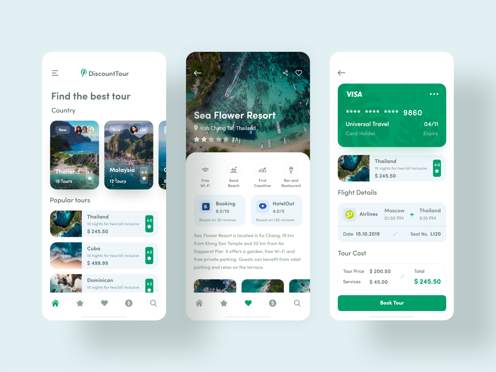

<div id="top"></div>
<!--
*** Thanks for checking out the Best-README-Template. If you have a suggestion
*** that would make this better, please fork the repo and create a pull request
*** or simply open an issue with the tag "enhancement".
*** Don't forget to give the project a star!
*** Thanks again! Now go create something AMAZING! :D
-->


<!-- PROJECT SHIELDS -->
<!--
*** I'm using markdown "reference style" links for readability.
*** Reference links are enclosed in brackets [ ] instead of parentheses ( ).
*** See the bottom of this document for the declaration of the reference variables
*** for contributors-url, forks-url, etc. This is an optional, concise syntax you may use.
*** https://www.markdownguide.org/basic-syntax/#reference-style-links
-->

<!-- PROJECT LOGO -->
<br />
<div align="center">
  <a href="https://github.com/harshbutani1801/tours_and_travels">
    
  </a>

  <h3 align="center">H.B. TOURS</h3>

  <p align="center"> 
    Great Ui For The Tours & Travels app. Created From the Behance Sample Template. In Flutter
    <br />
    <a href="https://github.com/harshbutani1801/tours_and_travels"><strong>Explore the docs »</strong></a>
    <br />
    <br />
    <a href="https://github.com/harshbutani1801/tours_and_travels">View Demo</a>
    ·
    <a href="https://github.com/harshbutani1801/tours_and_travels/issues">Report Bug</a>
    ·
    <a href="https://github.com/harshbutani1801/tours_and_travels/issues">Request Feature</a>
  </p>
</div>


<!-- TABLE OF CONTENTS -->
<details>
  <summary>Table of Contents</summary>
  <ol>
    <li>
      <a href="#about-the-project">About The Project</a>
      <ul>
        <li><a href="#built_with">Built with_</a></li>
      </ul>
    </li>
    <li>
      <a href="#getting-started">Getting Started</a>
      <ul>
        <li><a href="#prerequisites">Prerequisites</a></li>
        <li><a href="#installation">Installation</a></li>
      </ul>
    </li>
    <li><a href="#usage">Usage</a></li>
    <li><a href="#roadmap">Roadmap</a></li>
    <li><a href="#contributing">Contributing</a></li>
    <li><a href="#license">License</a></li>
    <li><a href="#contact">Contact</a></li>
    <li><a href="#acknowledgments">Acknowledgments</a></li>
  </ol>
</details>


<!-- ABOUT THE PROJECT -->
## About The Project

<a href="https://cdn.dribbble.com/users/2855653/screenshots/7140098/media/81bdc6113ec1730ba65b57481e93aaec.png">
    
</a>

<hr>

This is the Ui templete where i have repllicate the Ui templete from the Dribbble platform and done the ui part, and i think in case if you need the ui templete from Touring and travelling application you can use this for boathe Android, IOS.

Here's why:
* This Application is light and esy to use.
* This application is built from the fastest language : Flutter.
* It is simple to use.....

Of course, no one template will serve all projects since your needs may be different. So I'll be adding more in the near future. You may also suggest changes by forking this repo and creating a pull request or opening an issue. Thanks to all the people have contributed to expanding this template!

Use the `main.dart` to get started.

<hr>

### Built With

This section will let you Know from what this application is built

* [Flutter](https://flutter.dev/) `Main Code`
* [Dart](https://dart.dev/) `Backend Language`
* [GetX](https://pub.dev/packages/get) `State Management Code`
* [Velocit_X](https://pub.dev/packages/velocity_x) `Frontend Code`
* [Photoshop](https://www.adobe.com/in/products/photoshop.html) `Logo Creation`
* [Dribbble](https://dribbble.com/) `Idea`


<hr>

<!-- GETTING STARTED -->
## Getting Started

Follow all this Step to use this templete without any errors

### Prerequisites

First of All Clone this repository using

* Install Flutter

  ```
  git clone https://github.com/flutter/flutter.git -b stable  
  ```

### Installation

After Cloning the repository you just have to follow this Steps

1. Get a free Images i have used from here [Unsplash](https://unsplash.com/)
2. Clone the Repo
   ```
   git clone https://github.com/harshbutani1801/tours_and_travels.git
   ```
3. Install Dart Pub packages
   ```
   flutter pub add get
   ```
4. Install Velocity_X
   ```
   flutter pub add velocity_x
   ```
5. Install Google Fonts
   ```
   flutter pub add google_fonts
   ```
   
<hr>

<!-- USAGE EXAMPLES -->
## Usage

This temple will help you to show any products / touring packages and help you to learn flutter basic ui development and the Statemanagment application.

_For more examples, please refer to the [harshbutani1801](https://github.com/harshbutani1801)_

<hr>

<!-- ROADMAP -->
## Roadmap

- [x] Add Statemanagmet
- [x] Add Images of Hotel's
- [x] Add Description Pages of hotel's
- [ ] Add The Checkout page
- [ ] Other Small Details
    - [ ] Navigation Bar
    - [ ] Share to Friends
    - [ ] Like any Hotels


<hr>

<!-- CONTRIBUTING -->
## Contributing

Contributions are what make the open source community such an amazing place to learn, inspire, and create. Any contributions you make are **GREATLY APPRECIATED**.

If you have a suggestion that would make this better, please fork the repo and create a pull request. You can also simply open an issue with the tag "enhancement".
Don't forget to give the project a star! Thanks again!

1. Fork the Project
2. Create your Feature Branch (`git checkout -b feature/AmazingFeature`)
3. Commit your Changes (`git commit -m 'Add some AmazingFeature'`)
4. Push to the Branch (`git push origin feature/AmazingFeature`)
5. Open a Pull Request

<hr>

<!-- LICENSE -->
## License

Distributed under the MIT License. See `LICENSE.txt` for more information.

<hr>

<!-- CONTACT -->
## Contact

Harsh Butani - harshbutani24@gmail.com

Twitter - [@butani_harsh](https://twitter.com/butani_harsh)

Linkeidn - [harsh butani](https://www.linkedin.com/in/harsh-butani-a9637717a/)

Project Link: [tours_and_travels](https://github.com/harshbutani1801/tours_and_travels)

<hr>

<!-- ACKNOWLEDGMENTS -->
## Acknowledgments

Use this space to list resources you find helpful and would like to give credit to. I've included a few of my favorites to kick things off!

* [Choose an Open Source License](https://choosealicense.com)
* [GitHub Emoji Cheat Sheet](https://www.webpagefx.com/tools/emoji-cheat-sheet)
* [Malven's Flexbox Cheatsheet](https://flexbox.malven.co/)
* [Malven's Grid Cheatsheet](https://grid.malven.co/)
* [Img Shields](https://shields.io)
* [GitHub Pages](https://pages.github.com)
* [Font Awesome](https://fontawesome.com)
* [React Icons](https://react-icons.github.io/react-icons/search)

<p align="right">(<a href="#top">back to top</a>)</p>


<!-- MARKDOWN LINKS & IMAGES -->
<!-- https://www.markdownguide.org/basic-syntax/#reference-style-links -->
[contributors-shield]: https://img.shields.io/github/contributors/othneildrew/Best-README-Template.svg?style=for-the-badge
[contributors-url]: https://github.com/othneildrew/Best-README-Template/graphs/contributors
[forks-shield]: https://img.shields.io/github/forks/othneildrew/Best-README-Template.svg?style=for-the-badge
[forks-url]: https://github.com/othneildrew/Best-README-Template/network/members
[stars-shield]: https://img.shields.io/github/stars/othneildrew/Best-README-Template.svg?style=for-the-badge
[stars-url]: https://github.com/othneildrew/Best-README-Template/stargazers
[issues-shield]: https://img.shields.io/github/issues/othneildrew/Best-README-Template.svg?style=for-the-badge
[issues-url]: https://github.com/othneildrew/Best-README-Template/issues
[license-shield]: https://img.shields.io/github/license/othneildrew/Best-README-Template.svg?style=for-the-badge
[license-url]: https://github.com/othneildrew/Best-README-Template/blob/master/LICENSE.txt
[linkedin-shield]: https://img.shields.io/badge/-LinkedIn-black.svg?style=for-the-badge&logo=linkedin&colorB=555
[linkedin-url]: https://linkedin.com/in/othneildrew
[product-screenshot]: images/screenshot.png
